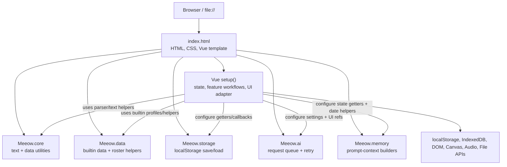
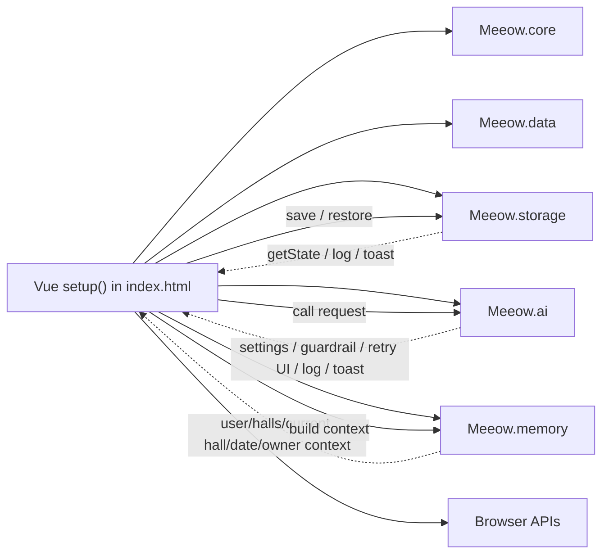

# Meeow House V2 — Phase 1 Architecture Map

## Scope and snapshot

This is a documentation-only map of the application as it exists on the
`refactor-extraction` branch (snapshot: `af11a9c`). It describes the current
classic-script, `window.Meeow` runtime without proposing any gameplay,
prompt, data, UI, or storage changes.

The application remains compatible with direct `file://` opening:

- Vue 3, JSZip, Tailwind CDN, and lunar-calendar support are loaded in
  [`index.html`](./index.html).
- Extracted code uses classic IIFE scripts and extends `window.Meeow`.
- The Vue application is still assembled in the inline `setup()` function in
  [`index.html`](./index.html#L8334).
- No module currently uses `import`, `export`, a bundler, npm, or a local
  `fetch()` loader.

## 1. Current architecture

### Runtime layout

The arrows from `App` to the extracted modules are deliberate dependency
injection points. The modules do not own a second copy of Vue state. The
remaining root application owns all reactive state and connects modules to
that state during `setup()`.

### Existing extracted modules

| Module | Current responsibility | Inputs / dependencies | Current ownership boundary |
|---|---|---|---|
| [`js/meeow-core.js`](./js/meeow-core.js) | Tolerant JSON parsing, text cleaning, colour normalization, SVG escaping, cloning. | No Vue state. | Stable pure utility module. |
| [`js/meeow-data.js`](./js/meeow-data.js) | Builtin halls/cats, canonical profiles, roster migrations, and pure roster-record merge helpers. | No Vue state; callers supply cat records. | Stable static-data and pure-data-helper module. Stateful roster application remains in `index.html`. |
| [`js/meeow-storage.js`](./js/meeow-storage.js) | Primary/legacy localStorage lookup, save serialization, model persistence, and the 350 ms save debounce. | Configured `getState`, storage keys, logging, and toast callbacks. | Storage transport is extracted. JSON parsing, state restoration, migration, and Vue assignment remain in `index.html`. |
| [`js/meeow-ai.js`](./js/meeow-ai.js) | FIFO request queue, dedupe, cancellation, foreground-over-background preemption, timeout/retry flow, retry modal coordination, and API transport. | Configured settings getter, canonical guardrail getter, `ThinkingLevel`, reactive retry/request UI state, logging, and toast callbacks. | AI infrastructure is extracted; feature-specific prompt construction and response application remain in `index.html`. |
| [`js/meeow-memory.js`](./js/meeow-memory.js) | Identity block, memory profiles, diary/monitor/focus/briefing selection, full memory context, and bounded Status Sync context. | Configured getters for user, halls, current hall, date/operational-day helpers, owner-daily context, and `cleanText`. | Prompt-context assembly is extracted. Daily lifecycle and status mutation remain in `index.html`. |

### `index.html` structure and recommended future ownership

Locations below are source anchors, not rigid module boundaries; individual
functions in a range often share Vue closure state.

| Location | Current responsibility | Important dependencies | Recommended future ownership |
|---|---|---|---|
| Template, styles, CDN setup, lines 1–8333 | All rendered pages, modals, navigation, and visual styling. | Vue template surface; Tailwind; DOM CSS. | Keep in `index.html` as the UI shell. |
| `setup()` bootstrap, lines 8334–8680 | Storage keys, initial user/settings/items, saved-data restore, builtin roster merge and legacy migration. | `Meeow.data`, `Meeow.storage`, reactive root state, localStorage. | Keep assembly/restore here until a dedicated app-composition phase. Migration helpers can later move only after their state boundary is explicit. |
| UI preferences and viewport helpers, lines 8681–8875 | Theme, custom font, safe-area/viewport handling, active-hall persistence. | `settings`, direct DOM styles, browser events, localStorage. | `meeow-app.js` UI adapter eventually; keep browser event wiring close to lifecycle for now. |
| Hall/map reference and map presentation, lines 8876–9259 | Map-room definitions, point lookup, marker calculations, map preview and room selection. | `cats`, `roomCats`, hall selection, template rendering. | First split only pure map definitions/lookups to `meeow-map.js`; retain mutations and template adapters in `index.html`. |
| Explore state and cross-hall visiting, lines 9260–9300 and exploration methods around 12003 | Exploration scene state, goals, rounds, dice, settlement, visitor transit. | `cats`, halls, AI calls, selected cat/hall, UI modal state. | Future `meeow-explore.js`, after a narrow state adapter is designed. |
| Interaction and modal state, lines 9299–9414 | Selected cat, homepage chat input, item guard, cat assets, bags, diaries, reports, loading/retry/status overlays. | Many template paths; AI, storage, map mutation. | Keep at root for now. Feature modules should receive explicit callbacks rather than own duplicated state. |
| Task/calendar/focus state, lines 9415–9524 | Todos, deadlines, schedules/ICS, focus timer/audio/music/wake lock and focus settlement. | `user`, cats, browser Audio/Wake Lock APIs, AI and daily reports. | Split calendar helpers before focus. Focus becomes `meeow-focus.js` only after timer/audio ownership is isolated. |
| Logs, notifications, admin UI, lines 9525–9567 | System log, toast/notification state, admin panel. | Template, all feature workflows. | Keep as root UI services; inject `addLog`/`showToast` into modules. |
| Phone, social, group chat, reader, games, lines 9660–13633 | Phone app state, contacts, private/group chat, moments, GNN, reader, wallet/composers, and mini-games. | `user.phoneData`, cat identity, AI, IndexedDB/DOM refs, template state. | Separate feature modules one at a time: reader first only after its phone-state adapter; then phone/social; games can remain local. |
| Status mutation and memory module configuration, lines 13710–13753 | `setCatStatus`, monitor/interaction events, map position inference, memory configuration. | Cats, map definitions, logs, current hall, local time. | Keep `setCatStatus` in the app until map state mutation has a safe adapter. `meeow-status.js` should receive it as an injected dependency initially. |
| Daily lifecycle, lines 14180–14751 | Operational-day keys, daily snapshot/archive prompt, archive application, retry/resume and record reset. | User/cats/halls, localStorage markers, AI, storage, status-day marker, UI modal. | High-risk future `meeow-daily.js`; extract only after explicit snapshot and application interfaces are documented. |
| Homepage chat and foreground interaction, lines 14752–15049 and 16093–16244 | Five-tag chat protocol, item interaction protocol, affinity/threshold side effects, friend request scheduling, follow-up status refresh. | Selected cat, user/cats/inventory, AI, memory, status mutation, UI guards. | Future `meeow-inventory.js` for item flow and a chat feature boundary later; do not move together. |
| Focus flow, lines 15050–15306 | Start/tick/finish focus, logs, AI voice content, settlement. | Focus state, timers/audio, user reports, cats, AI, status refresh. | Future `meeow-focus.js`; medium-to-high risk. |
| Hall Status Sync, lines 15253–156? | Whole-hall request construction, response contract validation, status application, completion/pending state, arrival retry integration. | `Meeow.memory`, `Meeow.ai`, cats/halls/settings/user, map mutation, localStorage, retry/loading UI. | Future `meeow-status.js`, but only after an injected `setCatStatus`/map adapter and task-scoped completion interface are retained. |
| Reader through gacha/adoption and remaining feature methods, lines 156?–16279 | Reader, adoption, wish/gacha generation, cat asset tools, utilities. | Phone data, IndexedDB/file APIs, data profiles, AI, cats. | Reader and inventory/adoption should be extracted as separate commits, never as one large “features” module. |
| Watchers, lifecycle, returned template API, lines 16280–16426 | Reveal threshold watcher, browser initialization, timers/event handlers, and the public Vue-template surface. | Every root state group and nearly every feature. | Keep root-level. Future modules should expose narrow methods; `setup()` remains the composition root. |

## 2. State inventory

The distinction below is intentional: persistent state is saved through
`Meeow.storage`, while the other groups are session/UI state unless stated
otherwise.

### Persistent root state

| State | Type | What it contains / owns |
|---|---|---|
| `user` | `reactive` | Profile (`nickname`, gender, birthday, job, currentStatus), currency/inventory, character stats/skills, schedules/calendars, todos/deadlines, mission reports, mailbox, mail counters, and all saved `phoneData`. `phoneData` includes chats, archives, moments, news, delivery, tarot, wallet records, contacts/requests, reader metadata, codex, and GNN data. |
| `settings` | `reactive` | API key/base URL/model/temperature, automatic update preference, theme-related font configuration, hall display mode, focus music settings, music search endpoint, and shared cat template. The selected model also has a dedicated localStorage key. |
| `cats` | `ref<Array>` | Resident records: stable identity fields (`id`, name, prompt, personality, origin, breed, eyeColor, hall), dynamic form/affinity/status/innerVoice/out/visit/map fields, interaction history, diary/log/travelogue records, timestamps, and avatar/sprite/pixel/paint resources. |
| `halls` | `ref<Array>` | Hall identity, guardian, visual/source metadata, destinations and hall-specific configuration. |
| `shopItems` | `ref<Array>` | Shop/inventory item definitions and user-added item records. |

### Derived hall, map, and navigation state

| State | Type | Responsibility |
|---|---|---|
| `currentTab`, `loungeView`, `activeHallId` | `ref` | Top-level navigation and selected hall. `activeHallId` is separately persisted. |
| `currentHall`, `roomCats` | `computed` | Current hall record and cats resident in it. |
| `hallDisplayMode`, `activeMapRoom`, `mapPreviewCat`, `showMapPointLabels` | `ref` | Hall/map presentation controls. |
| `allMapPoints`, `mapPointAliasIndex`, `activeMapRoomDefinition`, `mapCatMarkers`, `activeMapCatMarkers`, `mapOutCats`, `activeMapPointLabels` | `computed` | Map point resolution and render markers derived from cats/halls/map definitions. |
| `showHallCreator`, `hallCreator` | `ref` / `reactive` | Custom hall creation UI. |
| `hallSceneActive`, `hallScrollPositions`, `contentArea`, `chatMessagesRef`, `exploreChatRef` | UI refs/reactive | Scene rendering and scroll restoration; not saved. |

### Cat interaction, inventory, and social UI state

| State | Type | Responsibility |
|---|---|---|
| `selectedCat`, `chatInput`, `thinkingStates`, `isInteracting` | refs/reactive | Homepage-chat selection, input, per-cat thinking indicators, and foreground interaction guard. |
| `itemInteractionInFlight` | `ref` | Prevents duplicate item interaction during one request. |
| `isUpdatingStatus` | `ref` | Status sync activity indicator. |
| `showBag`, `currentBagTab`, `showShopModal`, `currentShopCategory`, `newItem`, `isSubmittingItem` | refs/reactive | Inventory/shop surfaces and draft item. |
| `showDiaryModal`, `showReportModal`, `showMissionSettlementModal`, `showMailModal`, `showLogModal`, `showEditCatModal` | `ref` | Cat/history/report/mail/log editor modals. |
| `showCatVisitModal`, `visitCat`, `visitTargetHallId`, `visitMessage`, `visitIsProcessing` | refs | Cross-hall visitor workflow. |
| `showPixelAvatarModal`, `pixelAvatarDraft`, `pixelAvatarWorkshopEnabled`, `spriteAssetRevision`, `showCatPaintModal`, paint refs/stacks | refs/reactive | Avatar/sprite/pixel workshop UI; source image resources live in cat records and IndexedDB. |
| `alfredMessage`, `todayEvent`, `todayEventContext`, `showSpecialEventModal`, `currentSpecialEventContent`, `showEasterEggBtn` | refs | Arrival copy, local holiday/event context, and special-event UI. |
| `friendsList`, `friendRequestInFlight` | derived/in-memory | Friend list projection and first-contact request dedupe. |

### Exploration, focus, calendar, and task state

| State | Type | Responsibility |
|---|---|---|
| `EXPLORE_LOCATIONS`, `exploreState`, `exploreInput`, `showExploreSettlement` | reactive/ref | Exploration destinations, selected companion/goals/history/rounds/dice/settlement and scene UI. |
| `newTodo`, `newDDL`, `newSchedule`, `ddlCountdownStr`, `currentTime`, `calendarContainer`, `showCalendarManager`, `fileInput`, `icsInput` | refs/reactive | Mission/calendar input, ICS import and timeline view. Persisted records ultimately write to `user`. |
| `isFocusing`, `focusCats`, `focusAction`, `focusTime`, `focusTotalTime`, `focusTimer`, `currentFocusLog`, `focusMessage` | refs | Active focus-session runtime state. |
| `currentNoise`, `customNoiseUrl`, `audioPlayer`, `focusMusicAudioPlayer`, `focusMusicPlaying`, `focusMusic`, `isFocusAudioPlaying` | refs/reactive | Focus audio/music player runtime state. |
| `isProcessingFocusTick`, `isFinishingFocus`, `focusSettlementLoading`, `currentSettlement`, `affinityChangeValue` | refs/reactive | Focus settlement lifecycle and feedback. |
| `focusVoiceEntries`, `focusVoiceIndex`, `currentFocusVoiceEntry`, `currentFocusVoice`, `currentFocusVoiceCat`, `focusWakeLockMessage`, `showFocusSetupModal`, `focusSetupData`, `availableCatsForFocus`, `canStartFocus` | refs/computed/reactive | Focus companion voice UI, Wake Lock status and setup dialog. |

### Phone, reader, social, and game state

| State | Type | Responsibility |
|---|---|---|
| `phoneState` | `reactive` | Current app/subtab, selected contacts/requests, composition and media dialogs, phone-side reader transient state, social/GNN state, and game surfaces. Persistent phone content is stored under `user.phoneData`. |
| `phoneIdentities`, `friendsList`, `groupChatState` | computed/in-memory/reactive | Derived cat contact identities, friend records and group-chat UI/session. |
| `phoneChatInput`, `phoneChatRef`, `phoneInputRef`, message-menu/emoji/composer refs | refs/reactive | Phone chat rendering and composer UI. |
| `readerBooks`, `activeReaderBook`, `activeReaderChapter`, `readerAvailableCats`, `readerScrollRef`, `readerTocRef`, chapter navigation and note computed values | computed/refs | Reader UI projection. Book metadata persists in `user.phoneData.reader`; book bodies use IndexedDB. |
| `slotState`, `tetrisState`, `mergeState`, `matchState`, `watermelonState`, `flappyState` | reactive/ref | Mini-game session state, kept in the phone feature area. |

### System, overlay, and AI-facing state

| State | Type | Responsibility |
|---|---|---|
| `isAppLoading`, `loadingProgress`, `loadingMessage`, `loadingOperation` | refs/reactive | Initial blocking application loader. |
| `hallEntryLoading` | `reactive` | Hall-arrival refresh overlay, scoped by frozen hall ID/request token and dismiss state. It is an interaction protector, not a hall-access gate. |
| `apiRetryModal` | `reactive` | General foreground request retry UI owned by Vue and consumed by `Meeow.ai`. |
| `dailyArchiveResumeModal`, `hallStatusRetryModal` | `reactive` | Task-specific daily and arrival-status recovery UI. |
| `activeAIRequestId` | `ref` | Vue-visible current request ID, updated by `Meeow.ai`; it is not a duplicate queue implementation. |
| `statusRefreshInFlight`, `hallStatusRefreshPending` | in-memory `Map` | Per-hall Status Sync task dedupe and pending recovery state; intentionally session-only. |
| `systemLogs`, `logWindow`, `notification`, notification timer | refs/reactive/closure | Log and toast/notification UI. |
| `availableModels`, `isFetchingModels` | refs | API model-list UI state. |
| `adoptMode`, `manualImgMode`, `isGachaLoading`, `gachaResult`, `newCat`, `isWishLoading` | refs/reactive | Adoption, Wish and gacha UI/session state. |
| `showAdminLogin`, `showAdminPanel`, `adminPassword`, `isAdmin`, `adminHallFilter`, `adminCats` | refs/computed | Admin surface state. |

### AI internals held outside Vue state

`Meeow.ai` owns `apiRequestQueue`, request dedupe map, cancelled batch set,
request sequence, queue-processing flag, and the active request/controller.
These are deliberately not duplicated in the root app. The Vue-owned
`activeAIRequestId` and `apiRetryModal` are injected into the module because
the template observes them.

### Browser-owned / non-reactive resources

- localStorage keys for the archive, selected model, active hall, map-label
  preference, daily/archive/status markers, and UI preferences;
- IndexedDB for reader bodies and asset-oriented data;
- Object URLs, `FileReader`, `FontFace`, Canvas contexts, `<audio>` objects,
  wake-lock handle, timers/intervals and DOM event listeners;
- local closure flags such as migration-save state, daily initialization
  promise/pause date, request sequences, notification timer, and focus wake
  lock.

## 3. Dependency and coupling analysis

### Dependency direction

There are no ES-module import cycles because this is not an ES-module graph.
There are, however, important runtime dependency loops:

1. The Vue application configures modules with callbacks into Vue state.
2. A feature in `index.html` obtains a context from `Meeow.memory` and sends
   it through `Meeow.ai`.
3. The feature then mutates root cats/user/UI state and the root persistence
   watcher sends that state through `Meeow.storage`.

This is a controlled composition loop rather than a module-to-module cycle,
but it means extracted modules must continue to receive explicit dependencies
instead of reading unrelated global state.

### Hidden or high-coupling boundaries

| Boundary | Why it is coupled | Extraction implication |
|---|---|---|
| `setCatStatus` | Combines status/innerVoice mutation, timestamping, map inference/fields and monitor logging. | Do not move it casually with Status Sync. Initially inject it into a status coordinator. |
| `_refreshAllStatus` / `refreshAllStatus` | Uses cats/halls/current hall/user/settings, memory builder, AI queue, map guide, operation-day marker, localStorage, logs/toasts, task dedupe and arrival UI. | High-risk; extract only as a faithful coordinator with an explicit dependency object. |
| Daily archive | Coordinates date boundaries, snapshots, reports, temporary-record cleanup, AI retries, persistence markers and UI recovery. | Keep untouched until its inputs/outputs are fully represented as a task interface. |
| Homepage chat and item use | Join foreground prompts, status mutation, affinity, records, inventory, threshold events, follow-up sync and UI loading. | Separate chat from inventory; do not move both into a generic interaction module. |
| Phone/reader | Persistent `user.phoneData`, transient `phoneState`, IndexedDB, DOM scroll refs and many UI handlers are interleaved. | Extract pure reader/phone data helpers before their workflow orchestration. |
| Focus | Timers, Audio/Wake Lock, cats, mission reports, AI and settlement UI share one flow. | Requires adapters for browser services and state before extraction. |
| Cat artwork | Cat records refer to saved assets while preview/editing uses IndexedDB, canvas and object URLs. | Keep resource lifecycle near browser UI until an asset service boundary is established. |

### Vue-specific coupling and direct DOM work

- The large `return { ... }` object at the end of `setup()` is the contract
  between the Vue template and all root workflows. Renaming or relocating a
  returned method without an alias is a template-breaking change.
- Watchers persist root state, maintain scroll positions, react to hall/tab
  changes, update log scrolling, trigger human-form threshold behavior and
  synchronize phone views. These are lifecycle behavior, not merely helpers.
- `onMounted()` owns safe-area/viewport listeners, keyboard controls, initial
  daily initialization, UI application, event timers and visibility handling.
- Direct DOM/browser calls occur in viewport styling and scrolling, canvas
  painting, file import/export, FontFace loading, audio playback, IndexedDB,
  object URL handling and Wake Lock. Those should remain in UI/lifecycle
  adapters rather than be pulled into data or AI modules.

## 4. Migration risk assessment

### Low risk — extract only pure/reference work first

| Candidate | Why it is low risk | Required boundary |
|---|---|---|
| Static map reference data, lookup tables and compact-map prompt guide | They can be read-only functions of map definitions and supplied values. | No cat mutation, no DOM, no current-hall read inside the module. |
| Calendar/ICS parsing and date-formatting helpers | These can return plain values with explicit arguments. | Keep writes to `user.schedule` in the app. |
| Reader content parsing/indexing helpers | They can operate on a supplied file/book string. | Keep IndexedDB and phone/reader UI state in the app initially. |
| Phone/social display formatters | Date grouping, message labels and small normalizers are pure or near-pure. | Keep mutations, AI calls and template refs in the app. |

### Medium risk — requires an adapter and narrow feature-by-feature commits

| Candidate | Why it needs an adapter |
|---|---|
| `meeow-map.js` presentation layer | Map computations are fairly separable, but live positions depend on cat state and `setCatStatus` currently mutates related fields. |
| `meeow-reader.js` | Reader data, companion notes and book progression can move, but it shares `phoneState`, IndexedDB, scroll refs and AI. |
| `meeow-phone.js` | The phone contains distinct social/chat/news/wallet/game workflows sharing `user.phoneData` and multiple template refs. |
| `meeow-inventory.js` | Item use has a clear transactional sequence but calls chat-card, affinity, threshold, Status Sync and UI guards. |
| `meeow-explore.js` | The feature has identifiable inputs/outputs, but shares hall/cat/AI/map state and settlement UI. |
| `meeow-focus.js` | Focus logic is coherent but must receive timer/audio/wake-lock/browser adapters and report/status callbacks. |

### High risk — retain until dependent adapters are stable

| Candidate | Why it should stay put for now |
|---|---|
| `meeow-status.js` coordinator | Status requests are currently a whole-hall task with strict response validation, map/status writes, pending/retry overlays, cache rules and preemption semantics. |
| `setCatStatus` | It is the shared mutation bridge between status, map positioning and monitoring records. |
| `meeow-daily.js` lifecycle | The 03:00 operational boundary has archive, retry/resume, localStorage markers, temporary-record cleanup and Status Sync interactions. |
| App assembly / template return surface | This is the composition root for every Vue state object, watcher and lifecycle hook; moving it before feature boundaries exist would be a rewrite rather than extraction. |

## 5. Proposed migration roadmap

This is a proposed order only. Every step is a separate behavior-preserving
commit followed by static checks and a real `file://` smoke test. A failed
smoke test should be isolated to that one commit rather than compounded.

1. `refactor: extract map reference helpers`
   - Move only static map definitions, point lookup/normalization and prompt
     guide formatting into `js/meeow-map.js`.
   - Keep map marker computeds and `setCatStatus` in `index.html`.

2. `refactor: extract reader content helpers`
   - Move parser/index/progress helper functions that accept explicit book
     data. Keep `phoneState`, IndexedDB, scrolling and companion AI calls in
     the root app.

3. `refactor: extract inventory interaction coordinator`
   - Move only the frozen-item/request/validation/apply orchestration behind
     injected callbacks. Keep UI modal state, `setCatStatus`, affinity,
     threshold and `refreshAllStatus` as injected app dependencies.

4. `refactor: extract phone data helpers`
   - Move phone archive/date grouping and small pure social helpers. Do not
     combine reader, phone chat, moments and games in one commit.

5. `refactor: extract explore coordinator`
   - Introduce `js/meeow-explore.js` with explicit cat/hall/AI/settlement
     dependencies, preserving existing root UI state.

6. `refactor: extract focus coordinator`
   - Introduce `js/meeow-focus.js` only after browser timer/audio/wake-lock
     services and report/status callbacks are explicitly injected.

7. `refactor: extract status sync coordinator`
   - Introduce `js/meeow-status.js` after keeping `setCatStatus`, map guide,
     UI status overlays, localStorage marker access and task completion
     metadata as explicit dependencies. Preserve the exact one-request
     whole-hall contract, response validator and preemption behavior.

8. `refactor: extract daily lifecycle coordinator`
   - Introduce `js/meeow-daily.js` after daily snapshot/create/apply steps
     are represented as explicit inputs/outputs. Preserve operational-day and
     archive recovery semantics exactly.

9. `refactor: assemble app adapters`
   - Create the final `meeow-app.js` only when the remaining root code is
     mostly Vue state, template adapters, watchers, lifecycle hooks and module
     configuration. Do not make this an excuse to alter the runtime model.

### Acceptance rule for every future extraction

Each proposed commit should meet all of the following before the next one:

- no prompt, gameplay, UI, schema, localStorage key, or runtime-model change;
- module configuration uses existing root state via explicit getters/callbacks;
- no duplicate Vue/UI state inside an extracted module;
- `node --check` for external scripts, a temporary syntax check of the inline
  app script, and `git diff --check` pass;
- real `file://` smoke testing covers save restore, hall entry, homepage chat,
  Status Sync, item use, a relevant feature path, hall switching and refresh.

## Conclusion

The project already has a sound Phase 1 foundation: pure core/data helpers,
storage transport, AI infrastructure, and memory-context construction have
clear `window.Meeow.*` homes. The next safe refactor work is not a broad
rewrite of `index.html`; it is a sequence of explicit adapters around the
remaining stateful coordinators. Status mutation, whole-hall synchronization
and daily lifecycle should remain high-risk boundaries until their existing
Vue, browser, map and recovery dependencies can be injected without changing
behavior.
