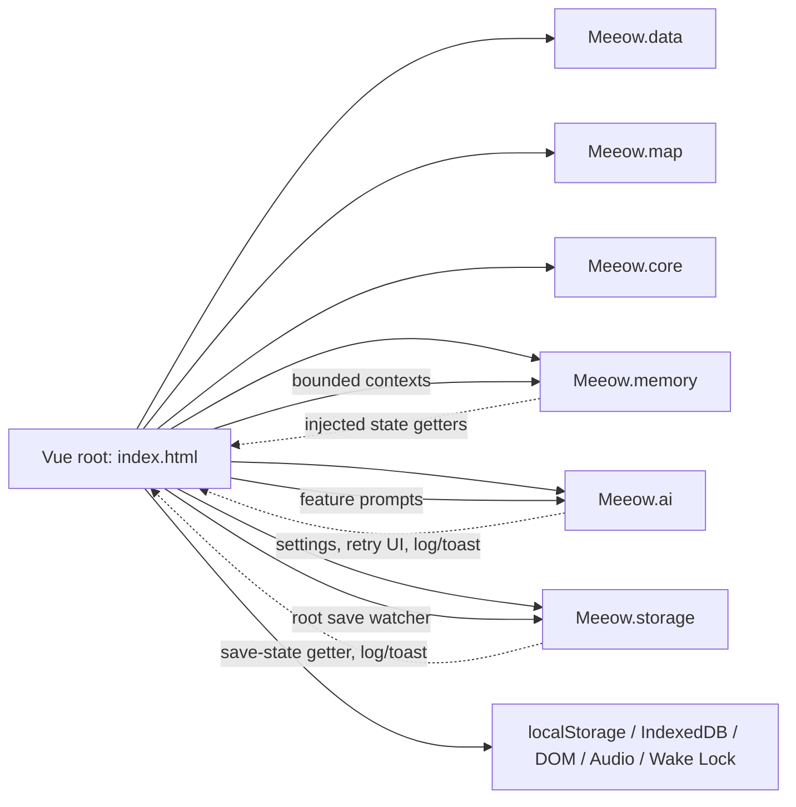

# Meeow House V2 — Domain Code Mapping

## Scope and reading rules

This is a read-only map between two sources of truth:

- **Domain intent:** *Meeow House AI Core World Bible & Simulation Protocol v2.0*.
- **Implementation truth:** the current Vue 3 classic-script application.

The World Bible defines responsibility and simulation intent. Current code defines runtime behavior, field names, storage layout, and execution flow. Differences are recorded only as **Intent / Implementation Notes**.

The application is currently multi-hall and supports direct `file://` opening. Current fields such as `hallId` and `origin` remain implementation facts; this document does not rename or migrate them.

## 1. World Lifecycle

### Intended responsibility

The World Bible separates operational-day settlement, daily archive, and background world simulation. Code owns time boundaries, snapshots, state writes, and persistence; AI supplies narrative or structured results from provided records.

### Current implementation

| Area | Location / functions | State and dependencies |
|---|---|---|
| Operational day | `index.html`: `getOperationalDate()`, `getOperationalDayKey()`, `getPreviousOperationalDayKey()` | Local clock with the implemented 03:00 boundary. |
| Archive construction | `buildDailyArchiveSnapshot()`, `getDailyArchiveTargets()`, `buildDailyArchivePrompt(snapshot)` | Reads `user`, `cats`, `halls`, daily records and snapshot date key. |
| Archive application | `applyDailyArchivePackage()`, reset helpers, `checkDailyInitialization()` | Writes report/diary outcomes and clears transient daily data after archive success; uses archive markers and `Meeow.ai`. |
| Background simulation | `_refreshAllStatus()`, `refreshAllStatus()` | Reads active hall/cats/user/settings; requests one whole-hall snapshot; applies through `setCatStatus()`. |
| Persistence | `js/meeow-storage.js` | Root save watcher supplies user/cats/halls/shopItems/settings through injected state getter. Daily markers remain direct localStorage dependencies in `index.html`. |

**Dependency direction:** root lifecycle state → archive/status prompt → `Meeow.ai.callAI()` → root validation/application → existing save watcher → `Meeow.storage`.

### Implementation status

- **Implemented:** operational-day keys, daily archive generation/application, marker recovery paths, and whole-hall background Status Sync.
- **Partially implemented:** the blueprint's lifecycle classes are feature workflows, not a standalone lifecycle coordinator.
- **Future domain intent:** additional periodic simulation, historical review, or settlement categories absent from current code.

### Refactoring risk

**High.** Archive and Status Sync each combine time, AI, root mutations, localStorage, task recovery UI, and persistence timing.

### Intent / Implementation Notes

- The blueprint's daily-memory boundary is currently reflected by operational-date filtering; it does not change mission-report fields.
- Older Gotham examples are domain examples. Current archive and simulation operate on the active multi-hall roster.

## 2. AI System

### Intended responsibility

AI is the narrative engine. It receives minimum task context and returns narrative or structured content. Code owns request control, IDs, time, validation, mutations, and persistence.

### Current implementation

| Layer | Location / functions | State and dependencies |
|---|---|---|
| Transport and queue | `js/meeow-ai.js`: `_doSingleAPICall()`, `_runAIRequest()`, `_processAIQueue()`, `callAI()` | Module-owned FIFO queue, dedupe, active controller, cancellation, retry, 40-second timeout and foreground-over-background preemption. Vue injects settings, guardrail, retry UI, logging and toast callbacks. |
| Parsing | `js/meeow-core.js`: `parseAIJSON()`, `cleanText()` | Existing tolerant parser and pure text helpers. |
| Prompt builders | Feature workflows in `index.html` | Homepage chat, item interaction, Status Sync, daily archive, Focus, Explore, Reader, Phone/social, GNN, Wish/gacha. |
| Response contracts | Caller-local validators in `index.html` | Homepage five-tag completion, item four-field object, whole-hall exact-ID Status Sync, and Reader note validation. |
| Callers | Feature methods in `index.html` | Foreground chat/item/reader/explore/focus and background status/friend/lifecycle work share the `callAI()` interface. |

**Dependency direction:** feature workflow → local prompt + `Meeow.memory` context → `Meeow.ai.callAI()` → local validator → feature-owned state application.

### Implementation status

- **Implemented:** OpenAI-compatible and Google transport paths, queue/retry/cancel/preemption, request diagnostics, and caller-local structured validation.
- **Partially implemented:** World Bible API categories exist as labels and workflows, not as a formal category registry.
- **Future domain intent:** new API categories or task types not represented by current callers.

### Refactoring risk

**Medium.** Transport is extracted, while prompt construction and response application intentionally remain tied to feature-local Vue state.

### Intent / Implementation Notes

- The blueprint's structured-generation rule is currently implemented by local contracts, not one global strict schema.
- “Minimum context” is implemented per task through profile-bounded memory and task-specific prompt builders.

## 3. Memory System

### Intended responsibility

The World Bible distinguishes Identity, Relationship, Episodic, and Current State memory. Each task should consume the smallest relevant temporal context.

### Current implementation

| Memory layer | Location / sources | Consumers and persistence |
|---|---|---|
| Identity Memory | `js/meeow-memory.js`: `buildCatIdentityBlock()`; builtin profiles in `js/meeow-data.js` | Canonical prompt, personality, breed, eye color, hall/form/affinity references. Stable fields live in saved cat records. |
| Relationship Memory | Cat `affinity`, `todayInteractions`, chat history; `appendInteractionEvent()` in `index.html` | Used by character contexts and feature workflows; saved with cats. |
| Episodic Memory | Cat `diary`, `logs`, `travelogues`; user `missionReports` | Selected/formatted by `getRecentMonitorEntries()`, `getPermanentDiaryEntries()`, `getCatFocusReports()`, `getLatestHouseBriefing()`. |
| Current State | Cat `status`, `innerVoice`, `isOut`, `isHuman`, map fields, timestamps | Read by full/status contexts; written by root workflows and saved with cats. |
| Context builders | `CAT_MEMORY_PROFILES`, `buildCatMemoryContext()`, `buildStatusSyncCatContext()` in `js/meeow-memory.js` | Configured through injected user/hall/date/owner-context getters; consumed by chat, item, Reader, Focus, Explore and Status Sync. |

**Dependency direction:** saved cat/user records → injected `Meeow.memory` getters → bounded context string → AI caller. Memory builders do not mutate or persist state.

### Implementation status

- **Implemented:** practical identity/relationship/episodic/current-state layers, profile-bounded character context, lightweight Status Sync context, current-operational-day Focus context, and previous-day briefing selection.
- **Partially implemented:** layers are existing fields/builders, not separate storage services.
- **Future domain intent:** new long-range memory policy not represented by current records or builders.

### Refactoring risk

**Low for the extracted builder module; medium for lifecycle-owned data sources.** The builders are read/format only, but daily reset/archive ownership remains in `index.html`.

### Intent / Implementation Notes

- Current daily filtering constrains daily/archive contexts only; it does not rule out future long-term recollection features.
- World Bible layer names are conceptual and do not require schema changes.

## 4. Cat State System

### Intended responsibility

Cats retain canonical identity and independent activity in a shared multi-hall world. AI proposes narrative state; code stores and applies observable state, relationships, and history.

### Current implementation

| State area | Location / functions | Persistence and dependencies |
|---|---|---|
| Resident records | `cats` ref in `index.html`; defaults/profiles in `js/meeow-data.js` | Stable metadata plus affinity, form/out state, status/voice, map placement, histories, timestamps and user assets; persisted in root save state. |
| Status / mood | `setCatStatus()` in `index.html` | Writes `status`, optional `innerVoice`, timestamp, map fields and monitor records. |
| Location / map | Static data/helpers in `js/meeow-map.js`; map computeds, `inferMapRoomFromStatus()`, `setCatStatus()` in `index.html` | Uses `mapRoom`, `mapPoint`/`mapSpot`, `mapFurniture`, `mapPositionLabel`, `isOut`. |
| Affinity / actions | `sendMessageInternal()`, `useItem()`, Focus/Explore settlement, `checkAffinityThreshold()` | Affinity and interaction effects write directly to cat records. |
| Histories | `appendInteractionEvent()`, `appendMonitorEvent()` | `todayInteractions`, `diary`, `logs`, `travelogues`; consumed by memory builders. |
| Background apply | `_refreshAllStatus()` | Validates whole-hall exact-ID responses before calling status/map/form/out mutations. |

**Dependency direction:** static profiles/map references + Vue cat state → feature or Status workflow → root mutation helpers → root save watcher.

### Implementation status

- **Implemented:** status/voice, map location, affinity, form/out state, interaction and monitor history, travel records, and whole-hall state application.
- **Partially implemented:** “mood” is represented by `status`, `innerVoice` and records instead of one dedicated numeric field.
- **Future domain intent:** extra cat action systems described only by the blueprint.

### Refactoring risk

**High.** `setCatStatus()` joins current state, map inference, timestamps, and monitor logging for multiple domains.

### Intent / Implementation Notes

- Current multi-hall residence uses `hallId`, not blueprint terms such as `homeBranch`.
- Shared-world bystander behavior is carried by Status Sync contracts; no separate persistent world-action record is introduced.

## 5. Exploration System

### Intended responsibility

Exploration is a hidden-KP, user-led adventure: supplied modules and history drive scenes, checks occur only with meaningful consequences, companions preserve cover, and settlement returns outcomes to the shared world.

### Current implementation

| Area | Location / functions | State and dependencies |
|---|---|---|
| Runtime state | `exploreState`, `exploreInput`, `showExploreSettlement` in `index.html` | Active location/companion, history, rounds, goal/module, checks/dice, processing, return progress and settlement. |
| Context / narration | `buildExploreKPContext()`, `requestExploreNarration()`, `parseExploreNarration()`, `advanceExploration()` | Reads user/cat/hall state, companion memory and scene history; may request a check or end naturally. |
| Return / settlement | `beginExploreReturn()`, `finishExploration()`, `closeExplore()` | Applies coins, affinity, inventory loot, Codex data, travelogue/log/monitor entries, then requests return Status Sync. |
| Dice / checks | Exploration state and methods in `index.html` | `currentCheck`, `waitingForDice`, `lastDiceResult`, `isRolling`; reads user stats/skills. |

**Dependency direction:** selected hall/cat + user stats + exploration session → KP prompt/AI narration → local history → settlement writes → existing Status Sync.

### Implementation status

- **Implemented:** companion/location state, module/narration rounds, checks, return settlement, rewards, travelogue and hall-status continuation.
- **Partially implemented:** all runtime state and cross-domain writes remain inside the root Vue closure.
- **Future domain intent:** additional exploration content/event categories only described by the blueprint.

### Refactoring risk

**High.** The flow joins AI, dice/UI, rewards, Cat State histories, travelogues, and Status Sync.

### Intent / Implementation Notes

- The blueprint's cover principle appears in existing exploration prompts and does not imply a storage migration.
- Durable outcomes currently use existing user/cat records, not a separate exploration persistence model.

## 6. Phone System

### Intended responsibility

Phone applications are world-facing or companion-facing surfaces with clear data ownership. The Reader retains local book text while preserving metadata, progress and companion notes.

### Current implementation

| Area | Location / functions | Persistence and dependencies |
|---|---|---|
| Phone UI state | `phoneState` and phone composer/scroll refs in `index.html` | Controls active app, chat/contact views, social dialogs, tarot/delivery, games, Reader transient state, GNN and Codex UI. Session-only. |
| Saved phone data | `user.phoneData` | Existing chats/archives, contacts/requests, moments, news/GNN, delivery/tarot/wallet, Reader metadata/annotations, Codex and application records. |
| Phone/social workflows | Helpers in `index.html`, including `openPhoneChat()` and GNN generation | Use cat identities, user phone data, AI where applicable, UI refs and the root save watcher. |
| Reader metadata / notes | Reader helpers in `index.html`, including `createReaderNotes()` | `user.phoneData.reader.books` stores metadata/progress; `annotations` stores cat notes. |
| Reader body store | `openReaderDB()`, `putReaderPayload()`, `getReaderPayload()` | IndexedDB database `meeow_house_reader_books_v1`, store `books`, stores EPUB/TXT body payload outside localStorage. |

**Dependency direction:** `phoneState` drives UI → feature functions read/write `user.phoneData` and cats → optional AI or IndexedDB work → root save watcher persists metadata. Book bodies are device-local IndexedDB data.

### Implementation status

- **Implemented:** phone shell, chat/social surfaces, GNN/Codex-related data, wallet/delivery/tarot/game UI state, Reader import/open/progress/annotations and IndexedDB book bodies.
- **Partially implemented:** phone apps share one large Vue closure and `user.phoneData` tree.
- **Future domain intent:** phone/social features described only in the blueprint and absent from current state/functions.

### Refactoring risk

**Medium to high.** Reader has a clear data boundary, but its UI state and cat-event writes remain coupled to root state. Other phone apps share broad UI state.

### Intent / Implementation Notes

- World Bible app categories are conceptual; current `phoneState` and `user.phoneData` shapes remain authoritative.
- Reader content intentionally bypasses root localStorage save; only metadata and notes are persisted in `user.phoneData`.

## 7. Focus System

### Intended responsibility

Focus is a companionship timer with live companion signals and a settlement that creates dated records and current-world continuity.

### Current implementation

| Area | Location / functions | State and dependencies |
|---|---|---|
| Timer runtime | `isFocusing`, `focusCats`, `focusAction`, `focusTime`, `focusTotalTime`, `focusTimer`, `currentFocusLog` in `index.html` | Driven by `startFocus()`, `focusTickBehavior()`, `finishFocus()` and setup/stop helpers. |
| Companion / UI | Focus setup state, voice entries, settlement loading, audio/music refs, Wake Lock helpers | Uses `roomCats`, user data, browser Audio/Wake Lock APIs, timers, logs/toasts and template state. |
| AI content | `focusTickBehavior()` and settlement flow | Uses `Meeow.memory.buildCatMemoryContext()` and `Meeow.ai.callAI()`. |
| Settlement / reports | `finishFocus()` | Writes focus records to `user.missionReports`, updates cat affinity/events, then requests Status Sync. |
| Daily-memory consumer | `Meeow.memory.getCatFocusReports()` and daily archive prompt construction | Ordinary cat context reads current operational-day reports; archive uses its own snapshot date boundary. |

**Dependency direction:** Focus UI + room cats → timer/audio/Wake Lock runtime → Focus AI/logs → `user.missionReports` and cat mutations → root persistence and Status Sync.

### Implementation status

- **Implemented:** setup, companion selection, timer, audio/music, Wake Lock, live log/voice, mission-report settlement and state follow-up.
- **Partially implemented:** browser resources, UI, reports and cat mutations remain in the root Vue closure.
- **Future domain intent:** additional Focus modes or report semantics absent from current implementation.

### Refactoring risk

**High.** Focus combines timers, browser resources, UI overlays, AI, report persistence, affinity/history writes and Status Sync.

### Intent / Implementation Notes

- Current mission reports are the implementation record for Focus; no new Focus schema follows from the blueprint.
- Operational-day filtering prevents stale Focus records entering daily character context without constraining future long-term memory features.

## Cross-domain dependency overview

The extracted modules deliberately do not own a second copy of Vue state. Root feature workflows gather state, construct context, validate feature-specific AI output, apply state changes, and let the existing watcher schedule persistence.

## Verification snapshot

- Referenced modules exist: `js/meeow-core.js`, `js/meeow-data.js`, `js/meeow-map.js`, `js/meeow-storage.js`, `js/meeow-ai.js`, and `js/meeow-memory.js`.
- Named root functions and state groups are present in `index.html` at the time of this mapping.
- This document introduces no schema, field, prompt, feature, or runtime change.

