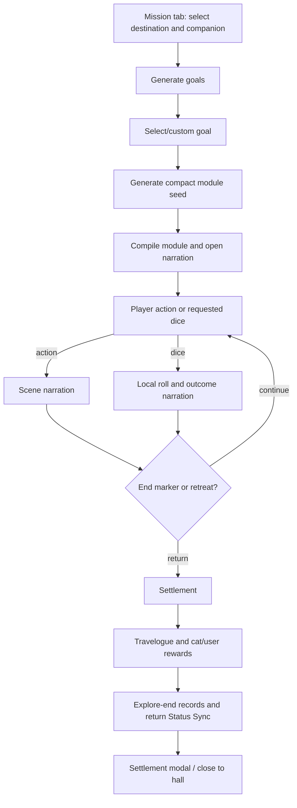

# Meeow House V2 — Exploration Boundary Audit

## Scope and evidence

This is a read-only map of the current exploration implementation. It describes runtime behavior in [`index.html`](index.html), with existing extracted modules named only where they are consumed. No code, prompt, schema, or UI behavior is changed by this document.

## 1. Current state ownership

| State | Current owner | Persistence / role |
| --- | --- | --- |
| `EXPLORE_LOCATIONS` | Root Vue setup (`index.html`, exploration state section) | Reactive runtime catalogue. It starts with built-in destinations, fills missing `hallId` values, and is extended from `halls[].destinations` plus newly generated custom halls. It is not independently saved. |
| `exploreState` | Root Vue setup | Reactive, session-only controller state: selected destination/companion, history, rounds, dice state, goal/module generation, settlement, and return-overlay progress. |
| `exploreInput`, `exploreChatRef`, `showExploreSettlement` | Root Vue setup / template | Input, DOM ref, and modal visibility. Session-only UI state. |
| `user.stats`, `user.skills` | Root `user` state | Read for checks and prompt context; persisted through the existing root save watcher. |
| `user.coins`, `user.inventory`, codex data | Root `user` state | Mutated by a successful settlement; persisted through the existing root save watcher. |
| Companion cat object | `cats` / `roomCats` root state | Shared cat record. Exploration can force cat form, alter affinity, append travelogue/log/interaction/monitor records, and later requests a return status update. These mutations persist with the existing cat save data. |
| Hall and destination data | `halls` root state | Existing custom-hall destinations are copied into the runtime catalogue at initialization; new hall creation also pushes generated destinations into it. |

`exploreState` itself is not serialized. Reloading clears an in-progress run, while already-applied cat/user mutations remain in the normal root save schema.

## 2. Exploration lifecycle

### Start and module setup

- Template handlers select a destination via `selectExploreLocation(loc)` and a non-`isOut` companion via `selectExploreCompanion(cat)`.
- `generateExploreGoals()` builds a memory-backed prompt using `buildCatMemoryContext(companion, { profile: 'exploreModule' })`. It requests three goals and has existing local fallback goals.
- `selectGoal()` and `submitCustomGoal()` set `exploreState.goal`, then call `generateModule()`.
- `generateModule()` constructs a compact seed with `buildExploreModuleBrief()`, validates JSON through `validateExploreModuleSeed()`, compiles it with `compileExploreModuleSeed()`, and calls `startExploration()`.
- `startExploration()` forces the companion into cat form, appends `explore-start` interaction and monitor records, optionally starts a friend request, resets run state, then requests an opening narration.

Current implementation note: starting exploration does **not** directly set the companion's `isOut` flag. The temporary run is represented by `exploreState`; status/out-of-hall behavior remains governed by existing cat state and later Status Sync behavior.

### Scene progression, narration, and dice

- `EXPLORE_KP_SYSTEM_PROMPT` supplies the narrative contract.
- `buildExploreKPContext()` reads the selected companion, halls, user profile/stats/skills, location, module, recent exploration history, and `Meeow.memory.buildCatMemoryContext()` output.
- `requestExploreNarration()` calls `Meeow.ai.callAI()` as a foreground request with `validateExploreNarration()`.
- `parseExploreNarration()` removes the `[请求检定：…]` and `<END_OF_EXPLORATION>` control markers and returns `{ content, requestedCheck, shouldEnd }`.
- `advanceExploration()` records the user action, recognizes retreat keywords, can add a probabilistic rescue context from another `isOut` room cat, derives pacing guidance from round count, and requests the next scene.
- `submitDiceRoll()` owns the animation timers, random d100 roll, Vue dice state, and history write. `getSkillValue()` reads `user.skills`/`user.stats`; `processDiceResult()` turns the computed result into an AI narration request.

### Settlement, rewards, and return

- `beginExploreReturn()` owns return-overlay state and fallback settlement handling, then calls `finishExploration()`.
- `finishExploration()` requests a settlement JSON, applies coins, affinity, optional loot, and optional codex lore directly to root user/cat state.
- It then requests a companion travelogue; writes `travelogues`, `logs`, interaction, and monitor records; and invokes `refreshAllStatus()` for the companion's post-return state.
- The settlement modal is displayed after the return path. `closeExplore()` resets session exploration state without changing the root save schema.

## 3. Dependency map

| Dependency | Exploration use | Direction |
| --- | --- | --- |
| `Meeow.ai.callAI` | Goals, module seed, opening/round/dice narration, settlement, travelogue | Root exploration controller → AI transport module |
| `Meeow.core.parseAIJSON`, `cleanText`, `getReadableAPIError` | Seed/settlement parsing, text cleanup, failures | Root exploration helpers/controllers → core/AI aliases |
| `Meeow.memory.buildCatMemoryContext` | Goal, KP, settlement, and travelogue prompt context | Root exploration prompt builders → memory module |
| `cats`, `roomCats`, `halls`, `currentHall`, `activeHallId` | Companion selection, destination context, rescue selection, return context | Exploration controller → Vue/root world state |
| `user` | Stats/skills, identity prompt context, coins, inventory, codex reward | Exploration controller → persisted user state |
| `appendInteractionEvent`, `appendMonitorEvent`, `setCatStatus`, `refreshAllStatus` | Start/end traces and return-state application | Exploration controller → root event/status systems |
| Root save watcher / `Meeow.storage` | Persists mutated `user`, `cats`, and `halls` automatically | Root reactive mutations → existing persistence boundary |
| Template and DOM refs | Selection UI, chat scroll, dice/return/settlement overlays | Template ↔ root Vue controller |

The current coupling is intentionally broad: the exploration controller coordinates AI, memory, user rewards, cat continuity, UI transitions, and status application. It is not a storage-only or prompt-only subsystem.

## 4. Extraction boundary assessment

### Pure helpers safe to extract later — low risk

These are deterministic when their existing dependencies are explicit:

- `getDiceResultClass(result)`;
- `parseExploreNarration(rawContent, cleanText)`;
- `validateExploreNarration(content, cleanText)`;
- `validateExploreModuleSeed(content, parseAIJSON)`;
- `compileExploreModuleSeed(seed, cleanText)`;
- settlement fallback formatting if rewritten to receive companion/location names rather than reading `exploreState`.

They should retain current signatures/return shapes or use thin root aliases. They must not acquire Vue, AI, storage, or cat mutation dependencies merely because they live near exploration code.

### Requires an adapter — medium risk

- Static built-in destination definitions could eventually move to a data/reference module, but `EXPLORE_LOCATIONS` is currently reactive and receives dynamic hall destinations. Extraction would need to preserve the existing root-owned runtime merge and `hallId` defaulting exactly.
- `buildExploreModuleBrief()` and `buildExploreKPContext()` are formatting-heavy but directly read root state and `Meeow.memory`. They need explicit getters/adapters before extraction; they are not currently pure helpers.
- Dice result classification and outcome-rule lookup can be grouped only if timer behavior, history mutation, and AI calls remain in the root controller.

### Must remain in the root application for now — high risk

- `generateExploreGoals`, `generateModule`, `startExploration`, `advanceExploration`, `submitDiceRoll`, `processDiceResult`, `beginExploreReturn`, `finishExploration`, and `closeExplore`.
- All `exploreState` mutations, template event handlers, modal/overlay state, chat scrolling, and timing animations.
- Reward writes, cat form/affinity/travelogue/log updates, event/monitor append calls, and return `refreshAllStatus()`.

These functions span multiple state owners and define the current transactional ordering. Moving them together would combine UI, AI, memory, inventory, cat state, persistence, and Status Sync risks in one change.

## 5. Future `Meeow.explore` boundary

A future `window.Meeow.explore` module should begin as a **protocol/helper layer**, not a lifecycle controller. Its safe initial ownership is the low-risk pure parser, validator, result-display, and module-compilation helpers above, all with explicit dependencies such as `cleanText` and `parseAIJSON` passed by the root application.

Only after that boundary is proven should a later controller extraction be considered. Such a controller would require explicit injected adapters for AI requests, cat/user state access, event writes, status refresh, logging/toasts, and UI notifications; it should not read Vue state implicitly or duplicate it internally.

## 6. Risk assessment

| Area | Risk | Reason |
| --- | --- | --- |
| Narration parser/validator and display-class helpers | Low | Explicit input/output behavior; no mutation. |
| Module-seed compiler and static destination references | Medium | Pure core exists, but current code embeds root context and runtime destination extension. |
| Prompt/context builders | Medium | Shared memory and root state reads must remain behavior-identical. |
| Dice execution | High | Couples timers, reactive flags, random outcomes, history, and AI continuation. |
| Start/advance/return/settlement controllers | High | Couples template state, cats, user rewards/inventory, event logs, AI, Status Sync, and persistence. |

## Audit conclusion

The safe next exploration extraction is a narrow helper-only commit, beginning with protocol parsing/validation and deterministic formatting helpers. The exploration lifecycle should remain in `index.html` until those helpers have been independently verified and an explicit dependency adapter can preserve the existing state-mutation order.
